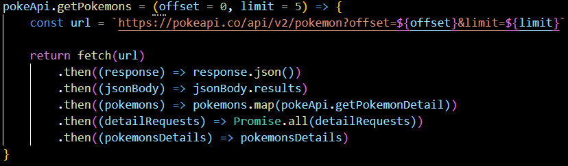
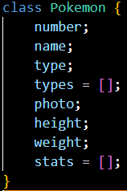

# Trilha JS Developer - Pokedex

## 📖 About the project
This is a Pokedex project developed as part of a bootcamp on the DIO platform, within the context of a fullstack development course. The web application uses the https://pokeapi.co API to list Pokémon, demonstrating the use of object-oriented programming and data manipulation through JSON, requests, promises, and other techniques.


### API manipulation


### Pokemon class


## 🦾 Technologies used
<div style="display: flex;">
  


</div>

## 🤔 What i learned
- Enhanced my skills in JSON data manipulation.
- Learned to perform HTTP requests more effectively.
- Understood the use of promises to handle asynchronous operations.
- Successfully integrated an API into a web page.
- Practiced creating a local server using Node.js and the HTTP module.
- Deepened my knowledge of HTTP responses.
- Gained insights into building standardized structures using JavaScript.

## 👽 How to clone this project

````bash
    # Select where you want to clone
    $ cd ~/Documents/WHERE_YOU_WANT
````

````bash
    # Clone the project
    $ git clone https://github.com/DevGustavus/REPOSITORY_NAME.git
````

````bash
    # Check if cloning worked fine
    $ cd ~/Documents/DIRECTORY_LOCATION
    $ ls
````
